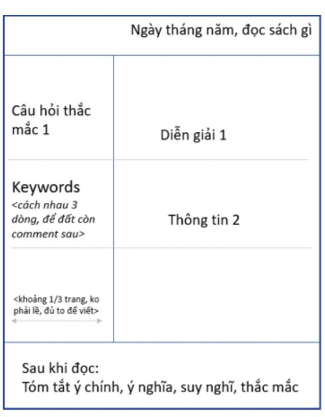

# Làm sao để không quên nội dung 1 cuốn sách
#cornellnote,
Phương pháp note Cornell
Sử dụng mẫu dưới để ghi lại quá trình đọc sách. 
- Khi đọc sách bắt đầu bằng những câu hỏi hoặc từ khóa. Ghi lại chúng
- Khi đọc được thông tin giải thích câu hỏi hoặc từ khóa thì ghi lại bên cột giải thích
- Sau khi đọc xong cuốn sách thì ghi lại 1 cách ngắn gọn xúc tích bằng 1 đoạn văn ngắn. 
	- Tóm tắt lại ý chính của chương sách
	- Suy nghĩ của bản thân về nội dung cuốn sách 
	- Nhận xét ngắn & thắc mắc của bản thân. 

