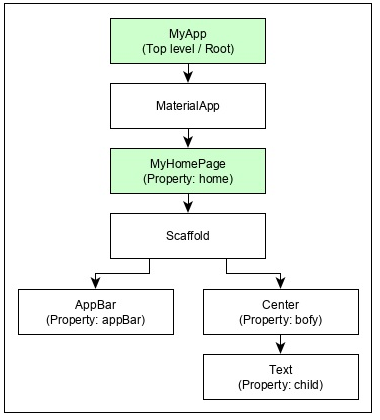

# Flutter Basic	
#flutter, #statelesswidget, #statefullwidget

## Cấu trúc 1 project flutter
- **android**: Thư mục code sinh tự động cho ứng dụng Android
- **ios**: Thư mục code sinh tự động cho ứng dụng iOS
- **lib**:  Main folder chứa Dart code được viết khi sử dụng flutter framework
- **lib/main.dart**: File khởi đầu chương trình của ứng dụng Flutter application
- **test**: Folder chứa Dart code để test flutter application
- **test/widget_test.dart**: Sample code
- **.gitignore** Git version control file. File chứa cấu hình cho project git
- **.metadata** Sinh tự động bởi flutter tools
- **.packages** sinh tự động để theo dõi flutter packages
- **.iml** project file của Android studio
- **pubspec.yaml** Được sử dụng để đăng ký **pub**, Flutter package mananger
- **pubspec.lock** Sinh tự động khi Flutter package manager chạy
- **README.md** Mô tả ứng dụng

## Khái niệm căn bản trong Flutter
### Widgets
Trong Flutter mọi thứ đều là [[Widget]]. Mỗi ứng dụng flutter là 1 widget ( Root widget) nó bao gồm một hoặc nhiều các widget con. Mỗi widget con có thể bao gồm 1 hoặc nhiều widget con khác.

### Layout
Trong Flutter, các [[flutter-layout]] cũng là 1 loại widget. Nhiệm vụ của người lập trình là sử dụng các widget này bố trí vị trí hiển thị của nó để tạo lên các layout khác nhau.

### Gestures
[[Flutter-Gestures]] là 1 tiện ích không hiển thị trên giao diện nhưng có khả năng nắm bắt các thao tác của người dùng như : Nhấp, kéo, vuốt, chạm. 

### State
Flutter widgets quản lý các  #State thông qua một widget đặc biệt là #statefullwidget . Tất cả các Widget cần #statefullwidget để quản lý các trạng thái(state) và kết nối với các widget khác. Flutter widget là 1 dạng reactive ([[reactive-programming]]) . #statefullwidget sẽ tự động thay đổi giao diện hiển thị khi thay đổi trạng thái. Khi nó thay đổi, sẽ tôí ưu chỉ thay đổi những thành phần liên quan, không thay đổi toàn bộ, chỉ vẽ lại những chỗ cần thiết nên sẽ hiệu quả hơn.

### Layers
[[Architectural-layers-Flutter-framework]] các thành phần sẽ được nhóm lại theo mức độ phức tạp và được sắp xếp rõ ràng theo các tầng có độ phức tạp giảm dần. 

## Các câu lệnh thường sử dụng khi dev 1 flutter app

### Câu lệnh thông thường
 - `flutter doctor` : Kiểm tra xem còn thiếu lib hay tool gì khi chạy app hay không
- `flutter run`: Chạy ứng dụng 
- `flutter --version`: Xem phiên bản hiện tại đang chạy flutter
- `flutter upgrade`: Upgrade phiên bản flutter hiện tại

### Tương tác với package
- `flutter pub get package-name`: Lấy 1 package để sử dụng
- `flutter pub test package-name`: Chạy test package
