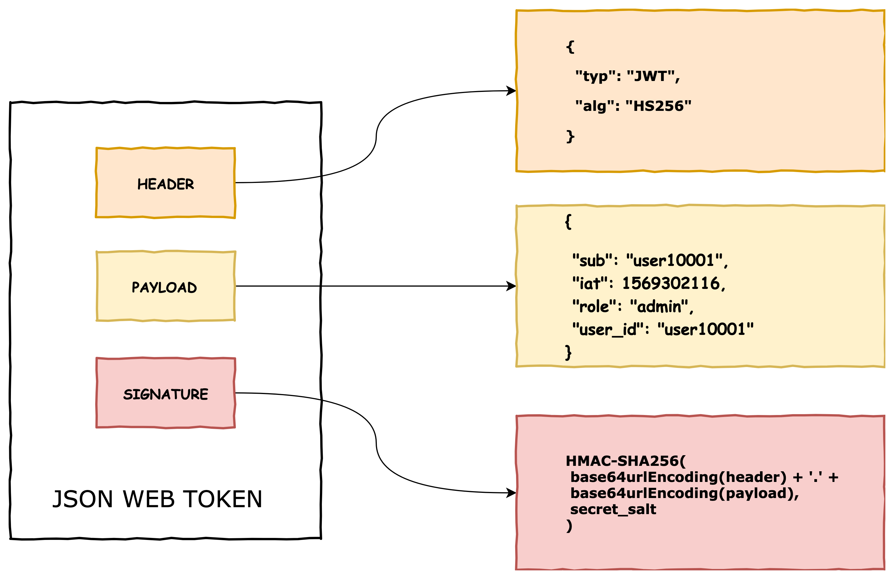
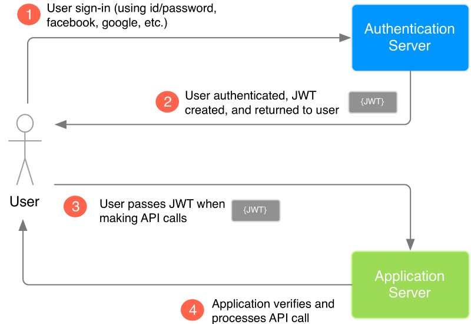

# JWT - JSon Web Token
#jwt, #authentication 
### Định nghĩa
**JWT - JSon Web Token** là 1 chuỗi json chứa thông tin được mã hóa lại bằng một phương pháp mã hóa. 

### Cấu trúc 1 JWT
Example:
```
eyJhbGciOiJIUzI1NiIsInR5cCI6IkpXVCJ9.
eyJzdWIiOiJuaHMzMTA4IiwiZXhwIjoxNTU4MDYzODM3fQ.
449KVmOFWcpOUjnYGm-f1QWhY8N-DerKDfTK0JQm1Nc
```

JWT bao gồm 3 phần, được phân cách nhau bởi dấu chấm `.`
- **Header**: `eyJhbGciOiJIUzI1NiIsInR5cCI6IkpXVCJ9`
- **Payload**: `eyJzdWIiOiJuaHMzMTA4IiwiZXhwIjoxNTU4MDYzODM3fQ`
- **Signature**: `449KVmOFWcpOUjnYGm-f1QWhY8N-DerKDfTK0JQm1Nc`

```javascript
<base64-encoded header>.<base64-encoded payload>.<HMACSHA256(base64-encoded signature)>    

```



#### Header
Header bao gồm 2 phần chính :
- *typ* : Loại token được sử dụng ( mặc định là JWT. Thông tin này cho biết Token này là token JWT)
- *alg*: Thuật toán dùng để mã hóa chuỗi JWT( HMAC SH256 - HS256, RSA)

Example:
```json
{
	"alg": "HS256",
	"typ": "JWT"
}
```
Mã hóa thông tin Header trên bằng base64
```python
import base64

message = "{\"alg\":\"HS256\",\"typ\":\"JWT\"}"
message_bytes = message.encode('ascii')
base64_bytes = base64.b64encode(message_bytes)
base64_message = base64_bytes.decode('ascii')

print(base64_message)
```
Kết quả: `eyJhbGciOiJIUzI1NiIsInR5cCI6IkpXVCJ9`

#### Payload
Payload là nơi chứa nội dung của thông tin. Nó được chia làm 3 loại *reserved*, *public*, *private*. 

1. **reserved**: những thông tin được quy định trọng chuẩn [Registered Claim Names](https://tools.ietf.org/html/draft-ietf-oauth-json-web-token-32#section-4.1.1). Thông tin dưới đây không bắt buộc. 
	- **iss (issuer)**: Tổ chức phát hành token
	- **sub (subject)**: Chủ đề của Token
	- **aud (audience)**: đối tượng sử dụng token
	- **exp (expired time)**: Thời điểm token hết hạn
	- **nbf (not before time)**: token chưa hợp lệ trước thời gian này
	-  **iat (issued at)**: thời điểm token được phát hành, tính theo UNIX time
	-  **jti**: JWT ID
2.  **public**: Có thể định nghĩa tùy theo ý muốn của người sử dụng JWT.
3.  **private**: Phần thông tin thêm dùng để truyền qua giữa các máy thành viên.
	```json
	{
		"sub": "user10001",
		"iat": 1569302116,
		"role": "admin",
		"user_id": "user10001"
	}
	```
	Kết quả base64: `eyJzdWIiOiJ1c2VyMTAwMDEiLCJpYXQiOjE1NjkzMDIxMTYsInJvbGUiOiJhZG1pbiIsInVzZXJfaWQiOiJ1c2VyMTAwMDEiIH0=`
#### Signature
Phần chữ ký được tạo ra bằng cách kết hợp 2 phần *Header*, *Payload*. Sau đó mã hóa bằng 1 giải thuật encode càng phức tạp càng tốt. Như dùng HMACSHA256.
Kết quả : `ZXlKaGJHY2lPaUpJVXpJMU5pSXNJblI1Y0NJNklrcFhWQ0o5LmV5SnpkV0lpT2lKMWMyVnlNVEF3TURFaUxDSnBZWFFpT2pFMU5qa3pNREl4TVRZc0luSnZiR1VpT2lKaFpHMXBiaUlzSW5WelpYSmZhV1FpT2lKMWMyVnlNVEF3TURFaUlIMD0`

Tổng kết lại ta có Token JWT
```
eyJhbGciOiJIUzI1NiIsInR5cCI6IkpXVCJ9.eyJzdWIiOiJ1c2VyMTAwMDEiLCJpYXQiOjE1NjkzMDIxMTYsInJvbGUiOiJhZG1pbiIsInVzZXJfaWQiOiJ1c2VyMTAwMDEiIH0=.ZXlKaGJHY2lPaUpJVXpJMU5pSXNJblI1Y0NJNklrcFhWQ0o5LmV5SnpkV0lpT2lKMWMyVnlNVEF3TURFaUxDSnBZWFFpT2pFMU5qa3pNREl4TVRZc0luSnZiR1VpT2lKaFpHMXBiaUlzSW5WelpYSmZhV1FpT2lKMWMyVnlNVEF3TURFaUlIMD0
```

### Luồng sử lý JWT


1. User thực hiện login bằng cách thông thường gửi username/password, hoặc login thông qua các mạng xã hội FB, Google, Github để Authentication Server xác thực.
2. Authentication Server nhận thông tin người dùng sử dụng. Trong trường hợp thành công, Authentication Server sẽ tạo ra 1 *token* trả về người dùng thông qua response.
3. Với các hành động tiếp theo của User, trong mỗi request đều gửi kèm token này như là 1 chìa khóa về phía Appliaction Server.
4. Application Server sử dụng toke JWT user gửi  lên để [[#JWT Verify]]. Nếu đúng tiếp tục thực hiện yêu cầu được gọi 

### JWT Verify
- Token JWT có cấu trúc **H.P.S** được *client* gửi lên Application Server. Application server sẽ tiến hành verify
	- set S1=S
	- set S2=HMAC(SHA256(**H.P**), secret_salt). Lưu ý: Phải dùng thuật toán cùng với thuật toán tạo **S** của token JWT.
	- if( S1 == S2) hợp lệ
